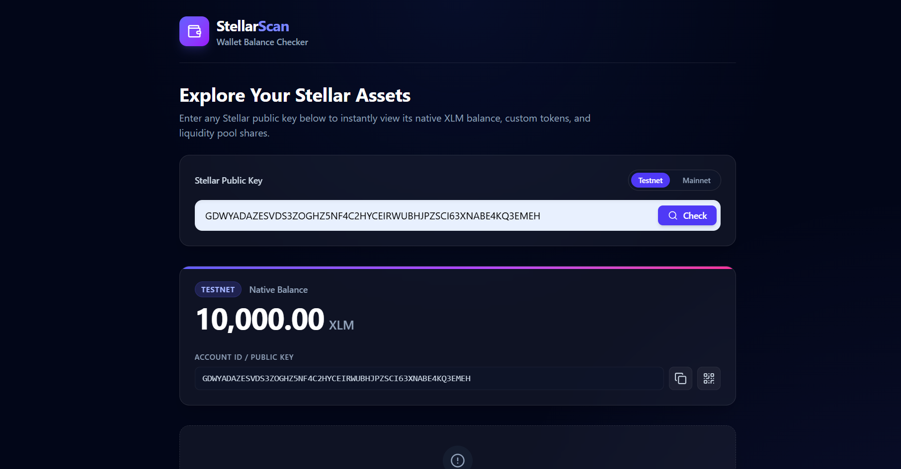
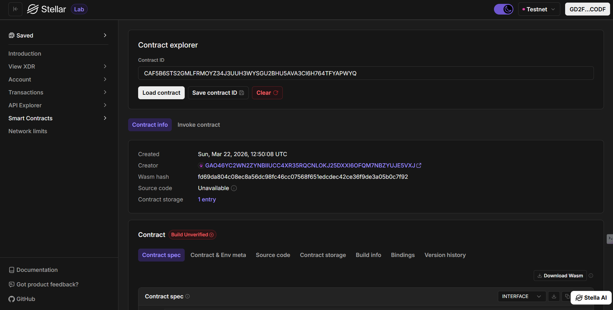

# Stellar Asset Explorer 🚀

A premium, decentralized Web3 dashboard built on the **Stellar** blockchain. This application allows users to instantly view native XLM balances, custom tokens, and liquidity pool shares for any public key, featuring a sleek dark-mode UI and real-time Horizon API integration.

## Project Overview

This repository is a comprehensive Stellar workspace, containing both a high-performance React frontend and a standard Soroban smart contract development environment.

## Features ✨

*   **Non-Custodial Data Fetching:** Instantly retrieve account details without needing to connect a secret key.
*   **Dual Network Support:** Seamlessly toggle between **Stellar Testnet** and **Public Mainnet** data.
*   **Token & LP Tracking:** View a comprehensive list of all assets held by an account, including trustlines and liquidity pool contributions.
*   **Real-time Ledger Data:** Powered by the official Stellar Horizon API for up-to-the-minute accuracy.
*   **Premium Glassmorphism UI:** A beautiful, responsive frontend built with React, Vite, and Tailwind CSS, optimized for both desktop and mobile.

## Dashboard Preview



### On-Chain Verification



---

## Project Architecture 🏗️

The project is structured as a standard Stellar development workspace:

1.  **Frontend (`/wallet-ui`)**: A React + Vite application leveraging `stellar-sdk` to interact with Horizon nodes.
2.  **Smart Contract (`/contracts/temple_donation`)**: A Soroban smart contract environment (Rust) ready for on-chain logic expansion.

---

## Getting Started 🚀

### Prerequisites

*   [Node.js](https://nodejs.org/) (v18+)
*   [Rust](https://www.rust-lang.org/) (v1.80+)
*   [Stellar CLI](https://developers.stellar.org/docs/build/smart-contracts/getting-started/setup)

### 1. Frontend Setup (React)

1.  Navigate to the UI directory:
    ```bash
    cd wallet-ui
    ```
2.  Install dependencies:
    ```bash
    npm install
    ```
3.  Start the development server:
    ```bash
    npm run dev
    ```
4.  Open `http://localhost:5173`.

### 2. Smart Contract Development (Soroban)

The root directory contains a `Makefile` to manage the smart contract workspace.

*   **Build**: Run `make build` to compile the contract.
*   **Test**: Run `make test` to execute Rust unit tests.
*   **Format**: Run `make fmt` to keep your code clean.
*   **Clean**: Run `make clean` to wipe build artifacts.

---

## Deployment Details

*   **Contract ID (Current):** `CB6PTH3TE2CL35IWGGP2MFQSEMATW66I44BF5SWGR3O2GL4CPWDIAJO2`
*   **Development Network:** Stellar Testnet

---
Built with 🧡 for the **Stellar Ecosystem**.
